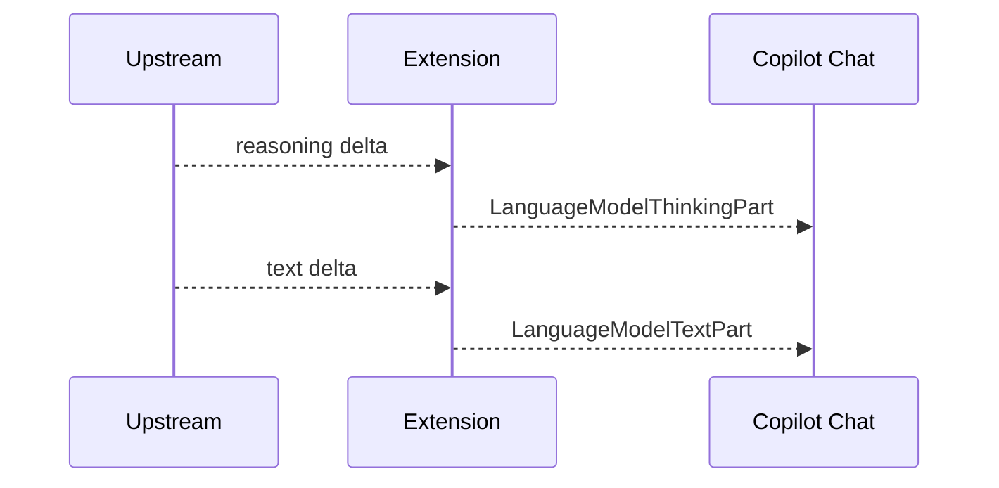

## 思考过程先于正文输出

原生 Custom Endpoint 在 Copilot Chat 中先发出思考（`LanguageModelThinkingPart`），再发出正文。本插件此前把正文流式推入队列，流结束后才追加思考，导致界面「先输出再思考」。

| ID | Given | When | Then |
| --- | --- | --- | --- |
| A1 | `openai-chat` 非流式响应同时含 `reasoning_content` 与 `content` | 读取 `response.stream` | 第一个 thinking part 出现在第一个 text part 之前 |
| A2 | `openai-chat` 流式先发 `reasoning_content` delta、再发 `content` delta | 读取 `response.stream` | 全部 thinking part 出现在第一个 text part 之前，流结束后不再追加思考 |
| A3 | `openai-responses` / `anthropic` 流式先发 reasoning/thinking delta | 读取 `response.stream` | 与 A2 相同：先思考，再正文 |

