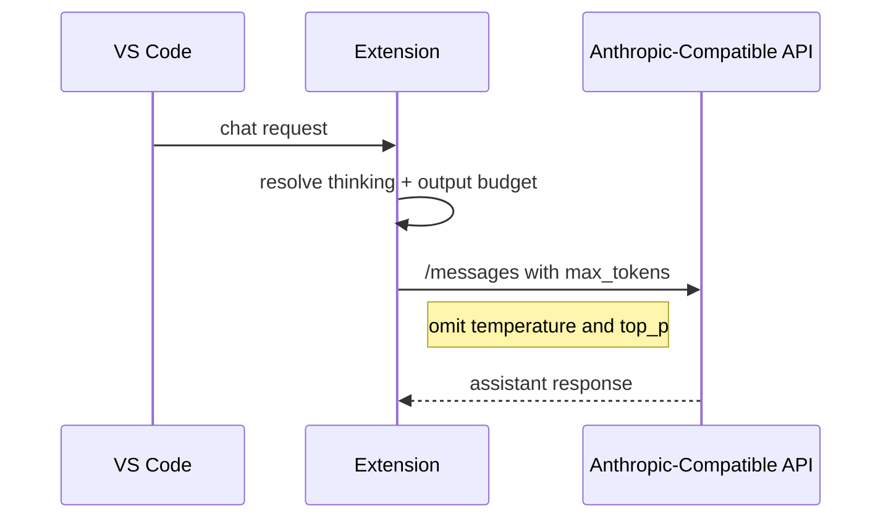

## Anthropic Sampling Compatibility

### Background

| Topic | Detail |
| --- | --- |
| Affected protocol | `anthropic` |
| Failure mode | 上游拒绝同时指定 `temperature` 与 `top_p`，返回 `Invalid request` |
| Current behavior | Anthropic 请求不发送 `temperature` 或 `top_p` |

### Request Design

### Implementation Notes

| Area | Change |
| --- | --- |
| `src/providers/genericProvider.ts` | Anthropic payload 省略 `temperature` 与 `top_p` |
| `src/test/runTest.ts` | 回归测试断言采样字段不出现在 payload 中 |
| `README.md` / `README.zh-CN.md` / `DEV.md` | 说明 `temperature` / `topP` 仅作为配置保留、运行时不下发 |
| `package.nls*.json` | 更新配置项文案，避免用户误判采样字段会下发 |
