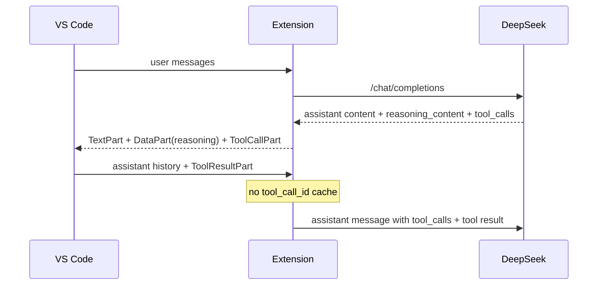

## DeepSeek Thinking Mode Round-Trip

### Background

| Topic | Detail |
| --- | --- |
| Affected protocol | `openai-chat` |
| Affected model shape | DeepSeek thinking mode responses that include `reasoning_content` |
| Failure mode | 工具调用后的下一次请求未回传 `reasoning_content`，上游返回 `400 invalid_request_error` |
| Current decision | 展示 thinking 过程；不按 `tool_call_id` 缓存/回填。仅当 VS Code 把 reasoning DataPart 带回 assistant 历史时，才通过消息转换恢复 `reasoning_content` |

### Current Design

### Implementation Notes

| Area | Change |
| --- | --- |
| `src/providers/baseProvider.ts` | 内部 `LanguageModelDataPart` MIME 类型仍用于展示 `reasoning_content`；若 VS Code 回传该 DataPart，消息转换会恢复该字段 |
| `src/providers/genericProvider.ts` | 不维护基于 `tool_call_id` 的 reasoning cache |
| `src/providers/genericProviderProtocols.ts` | 区分可见 `content` 与隐藏 `reasoningContent`，避免 tool-call-only 响应把思考文本当正文输出 |
| `src/test/runTest.ts` | 回归测试断言 tool continuation 默认不回传 `reasoning_content` |
