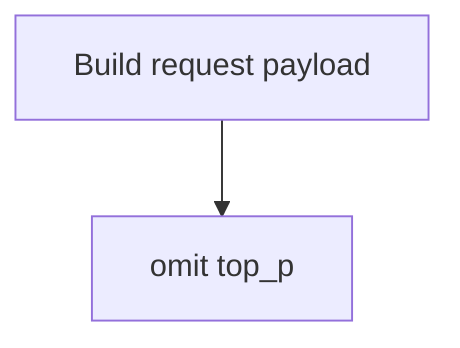

## Top-P Zero Omit Request

### Background

| Topic | Detail |
| --- | --- |
| Affected protocols | `openai-chat`, `openai-responses`, `anthropic` |
| Current behavior | `top_p` is never sent. Vendor / model `topP` keys remain in configuration. |

### Request Rule

### Implementation Notes

| Area | Change |
| --- | --- |
| `src/providers/genericProvider.ts` | 请求路径不拼接 `top_p` |
| `src/test/runTest.ts` | 回归测试断言正数 / 零值 `topP` 都不下发 |
| `README*` / `DEV.md` / `package.nls*` | 说明 `topP` 配置会保留，但不会下发 |
